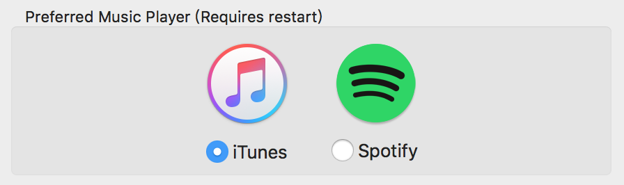
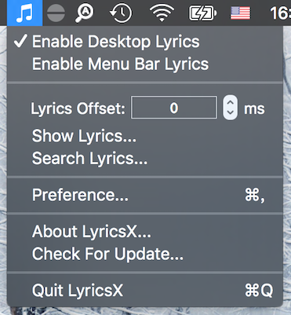
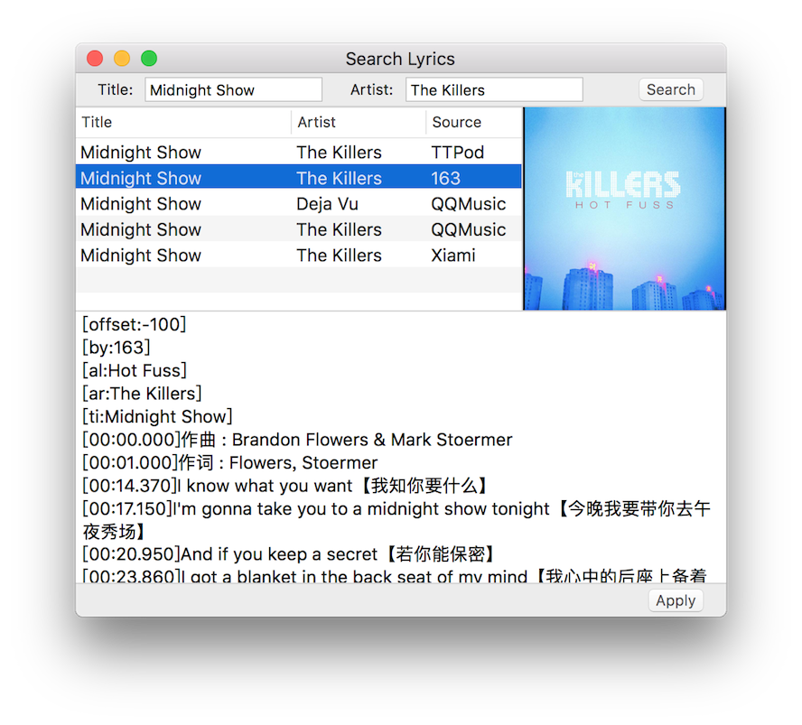
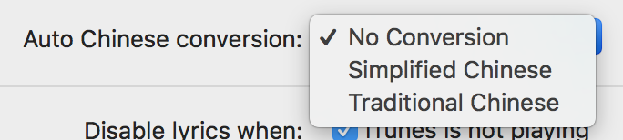
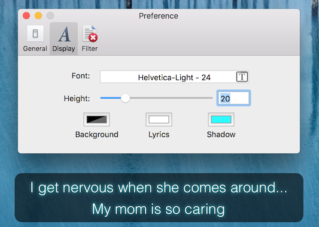

# LyricsX

LyricsX is a plugin for iTunes, Spotify and Vox, which auto search and download lyrics for the current playing from Internet, and displays them in the desktop and menu bar.

## Features

- Desktop lyrics

- Menubar lyrics

- Work perfectly with iTunes, Spotify and Vox.

- Adjust lyrics offset on status menu.

- You can search and choose lyrics manually.

- Auto convert Traditional Chinese or Simplified Chinese if you want.

- Live preview for font preferences.

