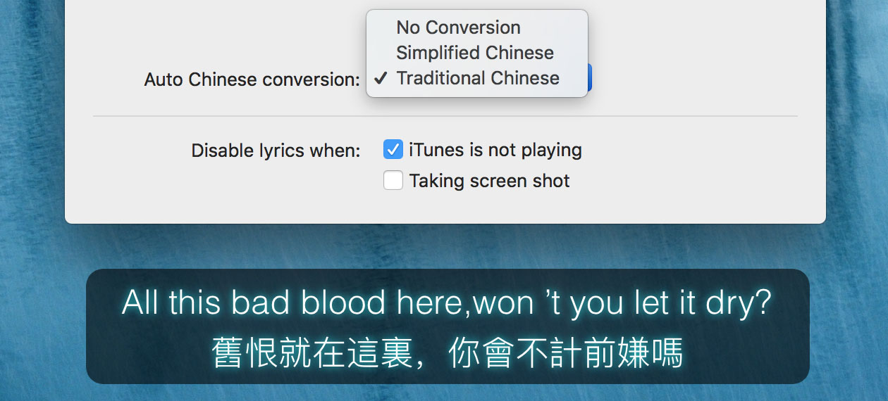

# LyricsX

LyricsX is a plugin for iTunes, Spotify and Vox, which auto search and download lyrics for the current playing from Internet, and displays them in the desktop and menubar.

## LyricsX for iOS

Coming soon...

## Installation

You can download ZIP from [releases](https://github.com/XQS6LB3A/LyricsX/releases).

### Requirements

- macOS 10.10+

## Features

- Work perfectly with iTunes, Spotify and Vox.
- Automatically search & download live lyrics.
- Display lyrics on desktop and menubar. you can customize font, color and position for desktop lyrics.
- Adjust lyrics offset on status menu.
- Navigate the song with lyrics - Double click a line to jump to specific position.
- Drag & Drop to import/export lyrics file.
- Auto launch & quit with music player.
- Automatic conversion between Traditional Chinese and Simplified Chinese.

### Lyrics Sources

- 163 Music
- QQ Music
- Kugou Music
- Xiami Music
- TTPod
- Gecimi

## Screenshot

## Open Source Libraries

- [SwiftyOpenCC](https://github.com/XQS6LB3A/SwiftyOpenCC)
- [GenericID](https://github.com/XQS6LB3A/GenericID)
- [Semver](https://github.com/XQS6LB3A/Semver)
- [SwiftyJSON](https://github.com/SwiftyJSON/SwiftyJSON)
- [SnapKit](https://github.com/SnapKit/SnapKit)
- [Then](https://github.com/devxoul/Then)

Special Thanks

- [Lyrics Project](https://github.com/MichaelRow/Lyrics)

## ⚠️ Disclaimer

All lyrics are property and copyright of their owners.
