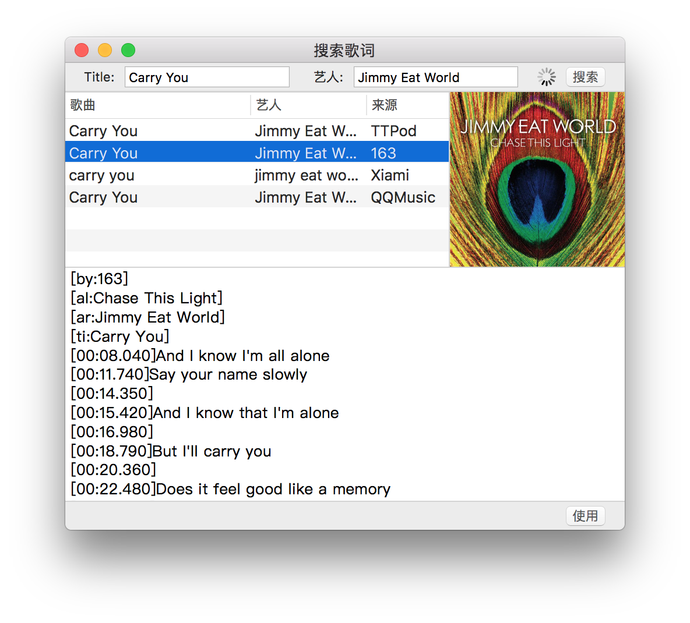
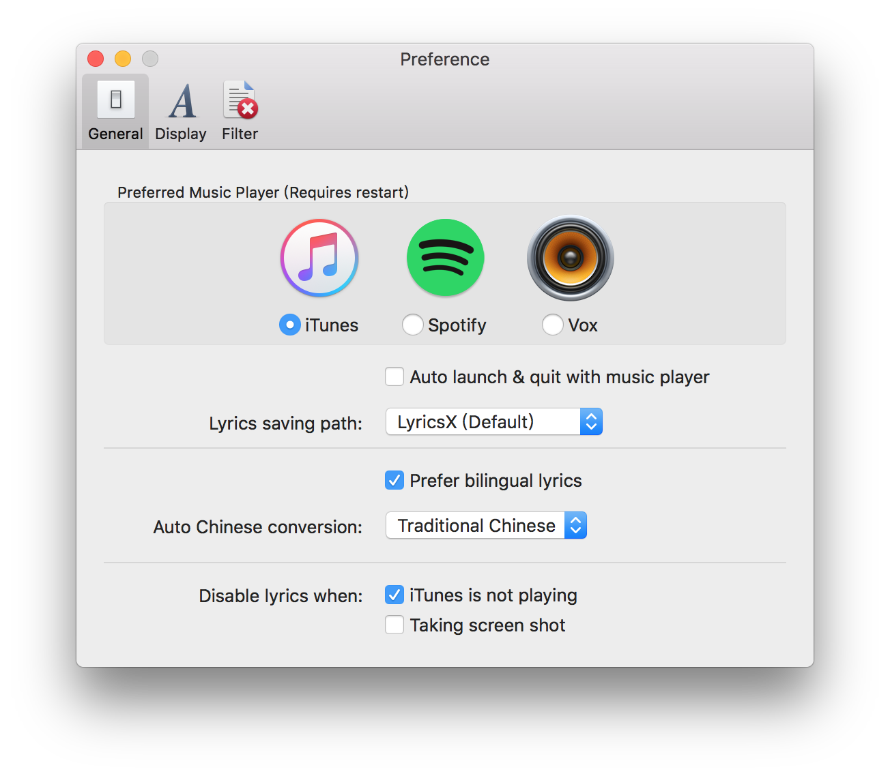

# LyricsX

LyricsX is a plugin for iTunes, Spotify and Vox, which auto search and download lyrics for the current playing from Internet, and displays them in the desktop and menubar.

## Features

- Work perfectly with iTunes, Spotify and Vox.
- Automatically search & download lyrics.
- Display lyrics on desktop and menubar.
- Adjust lyrics offset on status menu.
- Auto convert Traditional Chinese or Simplified Chinese if you want.

## Screenshot

