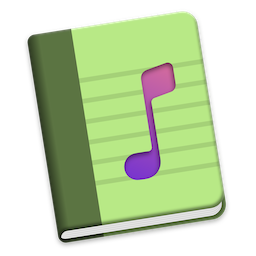
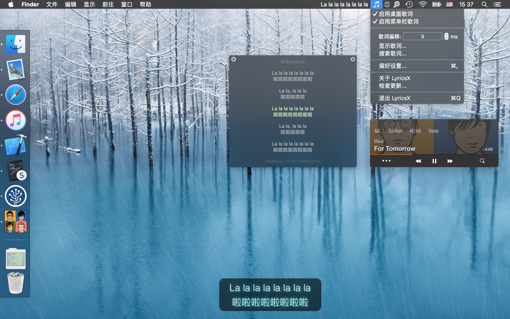
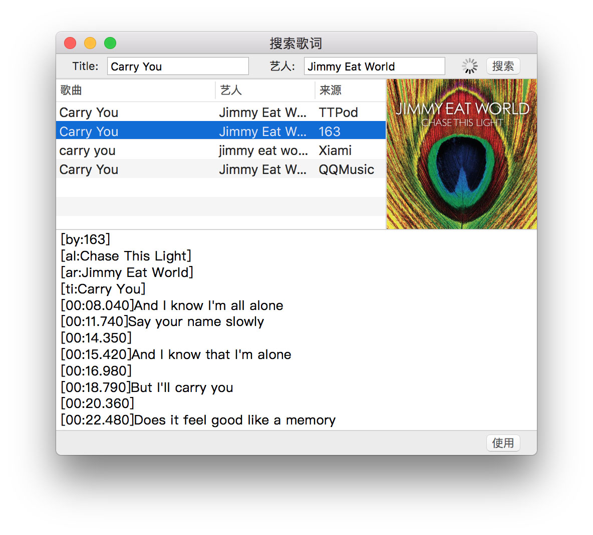
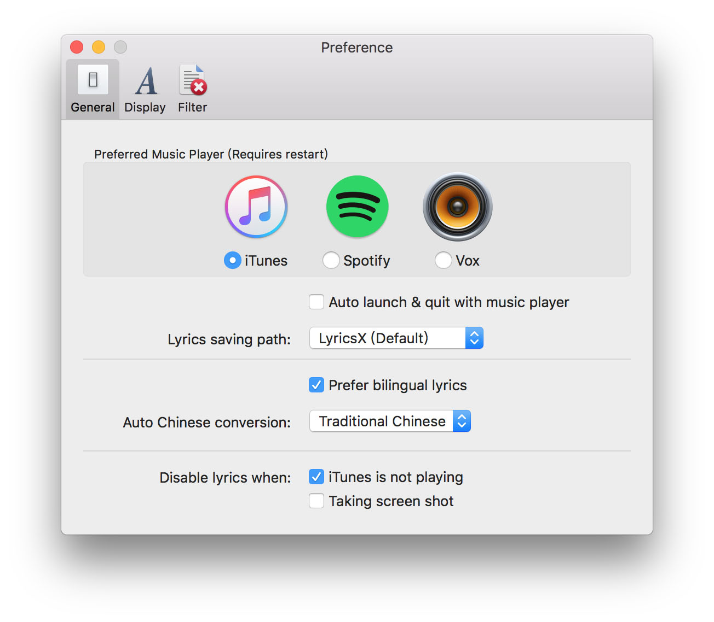

# LyricsX

[](https://crowdin.com/project/lyricsx)
[](https://telegram.me/LyricsXApp)
[](https://codebeat.co/projects/github-com-ddddxxx-lyricsx-master)



Ultimate lyrics app for macOS.

[LyricsX for iOS](https://github.com/ddddxxx/LyricsX-iOS) and [lyricsx-cli for Linux](https://github.com/ddddxxx/lyricsx-cli) is in early development.

## Installation

### Homebrew

```
$ brew install lyricsx
```

### Mac App Store

[](https://itunes.apple.com/us/app/lyricsx/id1254743014?mt=12)

### Manual

Download from [releases](https://github.com/ddddxxx/LyricsX/releases).

### Requirements

- macOS 10.11+

## Features

- Work perfectly with your favorite music players. [List of supported players](https://github.com/ddddxxx/MusicPlayer#supported-players)
- Automatically search & download live lyrics from various lyrics sources. [List of supported sources](https://github.com/ddddxxx/LyricsKit#supported-sources)
- Display lyrics on desktop and menubar. you can customize font, color and position.
- Adjust lyrics offset on status menu.
- Navigate the song with lyrics - Double click a line to jump to specific position.
- Drag & Drop to import/export lyrics file.
- Auto launch & quit with music player.
- Automatic conversion between Traditional Chinese and Simplified Chinese.

## Screenshot








## Credit

#### Components

- [LyricsKit](https://github.com/ddddxxx/LyricsKit)
- [MusicPlayer](https://github.com/ddddxxx/MusicPlayer)

#### Open Source Libraries

- [SwiftyOpenCC](https://github.com/ddddxxx/SwiftyOpenCC)
- [GenericID](https://github.com/ddddxxx/GenericID)
- [SwiftCF](https://github.com/ddddxxx/SwiftCF)
- [Regex](https://github.com/ddddxxx/Regex)
- [Semver](https://github.com/ddddxxx/Semver)
- [TouchBarHelper](https://github.com/ddddxxx/TouchBarHelper)
- [CombineX](https://github.com/cx-org/CombineX)
- [SnapKit](https://github.com/SnapKit/SnapKit)
- [MASShortcut](https://github.com/shpakovski/MASShortcut)
- [Sparkle](https://github.com/sparkle-project/Sparkle)
- [Then](https://github.com/devxoul/Then)

#### Special Thanks

- [Lyrics Project](https://github.com/MichaelRow/Lyrics)


## ⚠️ Disclaimer

All lyrics are property and copyright of their owners.
